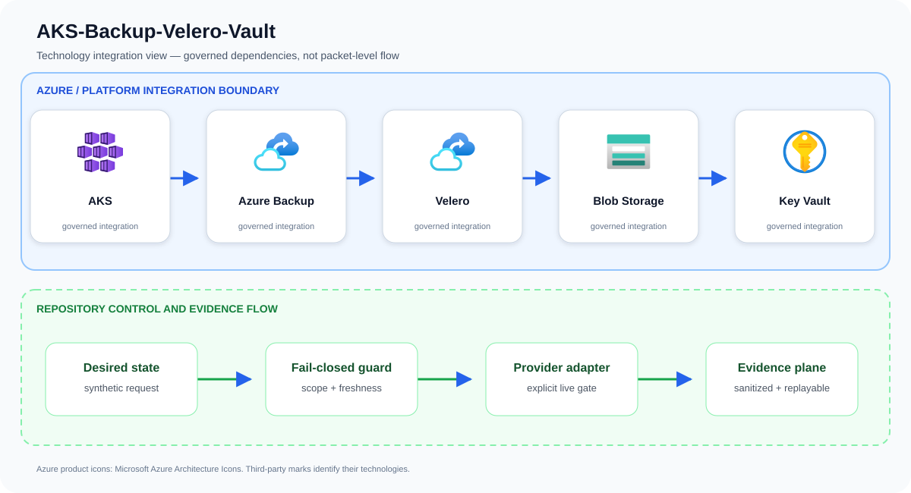
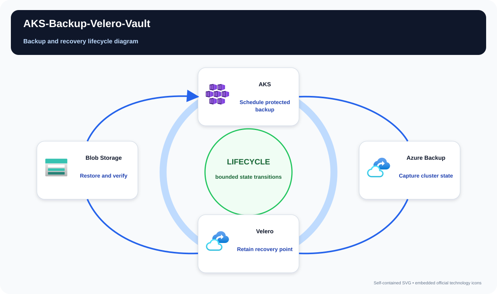

# AKS-Backup-Velero-Vault

Supply a tested AKS backup and disaster-recovery pattern with immutable recovery points.

## Project metadata

The metadata below is derived from tracked source, manifests, and infrastructure
files. It describes what this repository includes; live-service integration remains
bounded by the documented deployment and validation limitations.

| Category | Included |
| --- | --- |
| Platforms | Microsoft Azure; GitHub Actions; Kubernetes |
| Services and stack | AKS; Azure Backup; Velero; Blob Storage; Key Vault |
| Languages and formats | Python; Bicep; Bicep parameters; Bash; JSON; YAML |
| Delivery and IaC | Bicep + `.bicepparam`; GitHub Actions CI; Kubernetes/YAML manifests; Python validation/tests |

## Problem statement

A backup policy request validates cluster scope, workload identity, protected-target approval, private storage, and retention evidence before Velero and Azure backup adapters run.

A production implementation can still fail even when every resource deploys successfully. The material risk is a cluster that appears healthy while administration, workload identity, tenant isolation, recovery, scaling, or egress differs from the reviewed design. The design therefore treats AKS, Azure Backup, Velero, and the surrounding identity and evidence controls as one reviewable system rather than unrelated configuration tasks.

## Example case study

### Situation

A platform team can recreate its AKS cluster but cannot recover namespaces, persistent volumes, and application state after operator error. This design combines workload-aware backup with protected storage and documented recovery drills.

### Response

An online marketplace rehearses accidental namespace deletion against a clean recovery cluster. Operators verify Kubernetes objects, volume snapshots, retention locks, and key access before recording the observed recovery sequence against the agreed RPO and RTO.

The team first exercises the repository's synthetic approved and denied fixtures. An approved request must produce the same idempotent plan on replay; a stale, unscoped, public, or unapproved request must fail before an Azure adapter is allowed to run.

### Expected outcome

Stakeholders receive a decision package they can attach to a change record: requested scope, controls evaluated, the reason for approval or denial, and the explicit handoff to live integration. The example supports design review and incident rehearsal without pretending that a local test changed Azure.

## Architecture

Velero captures Kubernetes objects and CSI volume snapshots using workload identity; backup data lands in locked Blob storage, keys reside in Key Vault, and Azure Backup complements supported persistent workloads. Restore orchestration targets a clean cluster.

Primary services: `AKS`, `Azure Backup`, `Velero`, `Blob Storage`, `Key Vault`.

This repository implements the first production-oriented vertical slice: a
fail-closed, adapter-neutral control plane that validates tenant scope,
freshness, approvals, secretless identity, private access, and the exact
project action before producing a deterministic execution plan. Azure adapters
consume that plan; they are deliberately outside the local simulator so local
tests cannot claim a live cloud change occurred.



The upper boundary names the principal services and technologies used by this repository. The lower boundary shows the implemented control flow: desired state is validated, provider action remains an explicit integration gate, and sanitized evidence is retained for review and deterministic replay.

## Best complementary diagram

**Recommended view: Backup and recovery lifecycle diagram.** A lifecycle view is the strongest complement because it makes state transitions, approval points, expiry or recovery, and operational ownership explicit.



The view follows **Schedule protected backup → Capture cluster state → Retain recovery point → Restore and verify**. Use it during design reviews, operational walkthroughs, and failure-mode discussions; use the logical architecture above when the question is which technologies integrate.

## Quickstart

Requirements: Python 3.11+ and Git. No Azure credentials are required.

```bash
./scripts/validate.sh
python3 src/control_plane.py --request examples/approved-request.json
```

The command emits canonical JSON with a stable idempotency key. The denied
fixture exits with status 2 and explains the failed invariants.

## Security boundaries

- Managed identity or workload identity only; embedded credentials are denied.
- Public network access and stale evidence are denied.
- Production and break-glass targets require explicit approval.
- The IaC entry point is opt-in and defaults to deploying nothing.
- Evidence output contains identifiers and decisions, never credential values.

## Verification and limitations

Local validation covers 13 tests, deterministic replay, JSON parsing, Python
compilation, ignore hygiene, and Bicep compilation when a compiler is present.
It does **not** prove Azure deployment, service licensing, quota, data-plane
permissions, provider/API availability, cloud failover, load, cost, or teardown.
See [`docs/test-matrix.md`](docs/test-matrix.md) and [`docs/runbook.md`](docs/runbook.md) before any integration trial.

## Community

See [`CONTRIBUTING.md`](CONTRIBUTING.md), [`SECURITY.md`](SECURITY.md), [`SUPPORT.md`](SUPPORT.md), and [`LICENSE`](LICENSE). The reference
is intentionally conservative and uses synthetic identifiers only.

## Repository guide

- [Architecture](docs/architecture.md)
- [Threat model](docs/threat-model.md)
- [Operations runbook](docs/runbook.md)
- [Test matrix](docs/test-matrix.md)
- [Cost model](docs/cost-model.md)
- [Security policy](SECURITY.md)
- [Contributing guide](CONTRIBUTING.md)
- [Support policy](SUPPORT.md)
- [Changelog](CHANGELOG.md)
- [License](LICENSE)

## Infrastructure inputs

Resource behavior and deploy-time values are intentionally separated:

- [Bicep template](infra/main.bicep) — Azure resources, modules, and security controls.
- [Bicep parameters](infra/main.bicepparam) — environment-specific names, regions, identities, and feature inputs.

Start with the parameter file's safe values, replace synthetic identifiers, and run an Azure what-if before deployment.

## Attribution

Azure product icons come from [Microsoft's official Azure Architecture Icons](https://learn.microsoft.com/azure/architecture/icons/). Open-source marks are sourced from [Simple Icons](https://simpleicons.org/) when shown; each mark identifies its respective technology.
